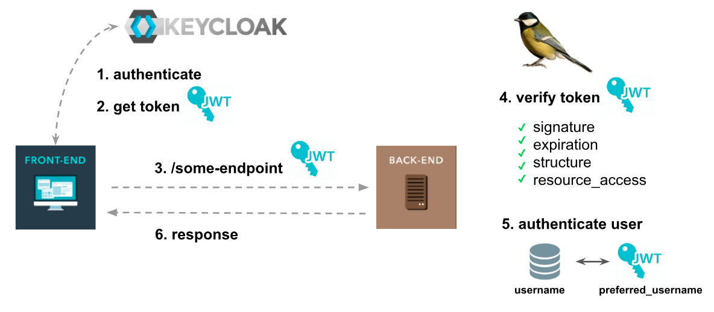

<p align="center">
  
</p>


# Simple Keycloak Guard for Lumen

This package helps you authenticate users on a Laravel API based on JWT tokens generated from **Keycloak Server**.

# Requirements

✔️ I`m building an API with Laravel.

✔️ I will not use Laravel Passport for authentication, because Keycloak Server will do the job.

✔️ The frontend is a separated project.

✔️ The frontend users authenticate **directly on Keycloak Server** to obtain a JWT token. This process have nothing to do with the Laravel API.

✔️ The frontend keep the JWT token from Keycloak Server.

✔️ The frontend make requests to the Laravel API, with that token.


# The flow

<p align="center">
  
</p>

1. The frontend user authenticates on Keycloak Server

1. The frontend user obtains a JWT token.

1. In another moment, the frontend user makes a request to some protected endpoint on a Laravel API, with that token.

1. The Laravel API (through `Keycloak Guard`) handle it.

   - Verify token signature.
   - Verify token structure.
   - Verify token expiration time.
   - Verify if my API allows `resource access` from token.

1. If everything is ok, then find the user on database and authenticate it on my API.

1. Optionally, the user can be created / updated in the API users database.

1. Return response

# Install

### Lumen

Require the package

```
composer require vivek-raghuvanshi/lumen-keycloak-guard
```

### Lumen only

Register the provider in your boostrap app file `bootstrap/app.php`

Add the following line in the "Register Service Providers" section at the bottom of the file.

```php
$app->register(\KeycloakGuard\KeycloakGuardServiceProvider::class);
```

For facades, uncomment `$app->withFacades();` in your boostrap app file `bootstrap/app.php`

# Configuration

## Keycloak Guard

⚠️ When editing `.env` make sure all strings **are trimmed.**

```bash
# Publish config file

php artisan vendor:publish  --provider="KeycloakGuard\KeycloakGuardServiceProvider"
```

✔️ **realm_public_key**

_Required._

The Keycloak Server realm public key (string).

> How to get realm public key? Click on "Realm Settings" > "Keys" > "Algorithm RS256" Line > "Public Key" Button

✔️ **load_user_from_database**

_Required. Default is `true`._

If you do not have an `users` table you must disable this.

It fetchs user from database and fill values into authenticated user object. If enabled, it will work together with `user_provider_credential` and `token_principal_attribute`.

✔️ **user_provider_custom_retrieve_method**

_Default is `null`._

If you have an `users` table and want it to be updated (creating or updating users) based on the token, you can inform a custom method on a custom UserProvider, that will be called instead `retrieveByCredentials` and will receive the complete decoded token as parameter, not just the credentials (as default).
This will allow you to customize the way you want to interact with your database, before matching and delivering the authenticated user object, having all the information contained in the (valid) access token available. To read more about custom UserProviders, please check [Laravel's documentation about](https://laravel.com/docs/10.x/authentication#adding-custom-user-providers).

If using this feature, obviously, values defined for `user_provider_credential` and `token_principal_attribute` will be ignored.

✔️ **user_provider_credential**

_Required.
Default is `username`._

The field from "users" table that contains the user unique identifier (eg. username, email, nickname). This will be confronted against `token_principal_attribute` attribute, while authenticating.

✔️ **token_principal_attribute**

_Required.
Default is `preferred_username`._

The property from JWT token that contains the user identifier.
This will be confronted against `user_provider_credential` attribute, while authenticating.

✔️ **append_decoded_token**

_Default is `false`._

Appends to the authenticated user the full decoded JWT token (`$user->token`). Useful if you need to know roles, groups and other user info holded by JWT token. Even choosing `false`, you can also get it using `Auth::token()`, see API section.

✔️ **allowed_resources**

_Required_.

Usually you API should handle one _resource_access_. But, if you handle multiples, just use a comma separated list of allowed resources accepted by API. This attribute will be confronted against `resource_access` attribute from JWT token, while authenticating.

✔️ **ignore_resources_validation**

_Default is `false`_.

Disables entirely resources validation. It will **ignore** _allowed_resources_ configuration.

✔️ **leeway**

_Default is `0`_.

You can add a leeway to account for when there is a clock skew times between the signing and verifying servers. If you are facing issues like _"Cannot handle token prior to <DATE>"_ try to set it `60` (seconds).

✔️ **input_key**

_Default is `null`._

By default this package **always** will look at first for a `Bearer` token. Additionally, if this option is enabled, then it will try to get a token from this custom request param.

```php
// keycloak.php
'input_key' => 'api_token'

// If there is no Bearer token on request it will use `api_token` request param
GET  $this->get("/foo/secret?api_token=xxxxx")
POST $this->post("/foo/secret", ["api_token" => "xxxxx"])
```

## Laravel Auth

Changes on `config/auth.php`

```php
...
'defaults' => [
        'guard' => 'api', # <-- For sure, i`m building an API
        'passwords' => 'users',
    ],

    ....

    'guards' => [
        # <!-----
        #     Make sure your "api" guard looks like this.
        #     Newer Laravel versions just removed this config block.
        #  ---->
        'api' => [
            'driver' => 'keycloak',
            'provider' => 'users',
        ],
    ],
```


## Lumen Routes

Just protect some endpoints on `routes/web.php` and you are done!

```php
// public endpoints
$router->get('/hello', function () {
    return ':)';
});

// protected endpoints
$router->group(['middleware' => 'auth'], function () {
    $router->get('/protected-endpoint', 'SecretController@index');
    // more endpoints ...
});
```

# API

Simple Keycloak Guard implements `Illuminate\Contracts\Auth\Guard`. So, all Laravel default methods will be available.

## Default Laravel methods

- `check()`
- `guest()`
- `user()`
- `id()`
- `validate()`
- `setUser()`
- `hasScope()`
- `upsertUser()`
- `getRoles()`

## Keycloak Guard methods

`token()`
_Returns full decoded JWT token from authenticated user._

```php
$token = Auth::token()  // or Auth::user()->token()
```

<br>

`hasRole('some-resource', 'some-role')`
_Check if authenticated user has a role on resource_access_

```php
// Example decoded payload

'resource_access' => [
  'myapp-backend' => [
      'roles' => [
        'myapp-backend-role1',
        'myapp-backend-role2'
      ]
  ],
  'myapp-frontend' => [
    'roles' => [
      'myapp-frontend-role1',
      'myapp-frontend-role2'
    ]
  ]
]
```

```php
Auth::hasRole('myapp-backend', 'myapp-backend-role1') // true
Auth::hasRole('myapp-frontend', 'myapp-frontend-role1') // true
Auth::hasRole('myapp-backend', 'myapp-frontend-role1') // false
```

`hasAnyRole('some-resource', ['some-role1', 'some-role2'])`
_Check if the authenticated user has any of the roles in resource_access_

```php
Auth::hasAnyRole('myapp-backend', ['myapp-backend-role1', 'myapp-backend-role3']) // true
Auth::hasAnyRole('myapp-frontend', ['myapp-frontend-role1', 'myapp-frontend-role3']) // true
Auth::hasAnyRole('myapp-backend', ['myapp-frontend-role1', 'myapp-frontend-role2']) // false
```

# Contribute

You can run this project on VSCODE with Remote Container. Make sure you will use internal VSCODE terminal (inside running container).

```bash
composer install
composer test
composer test:coverage
```

